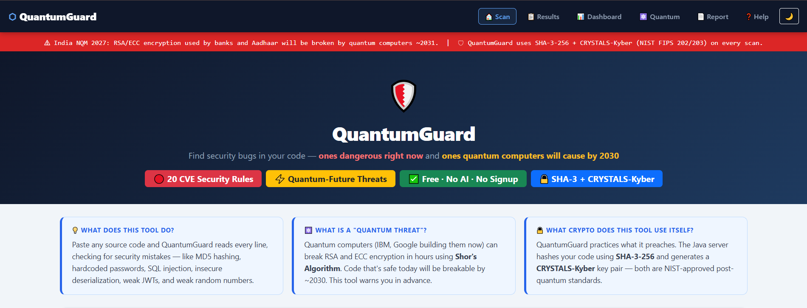
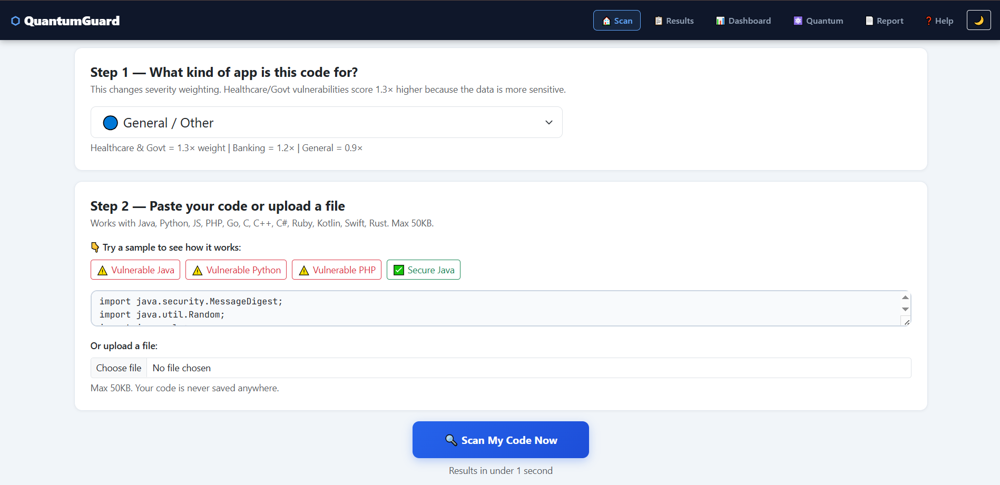
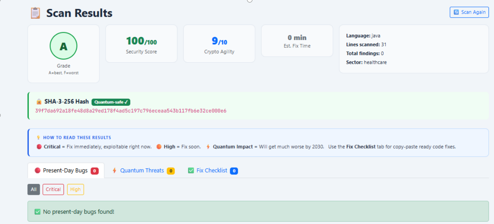
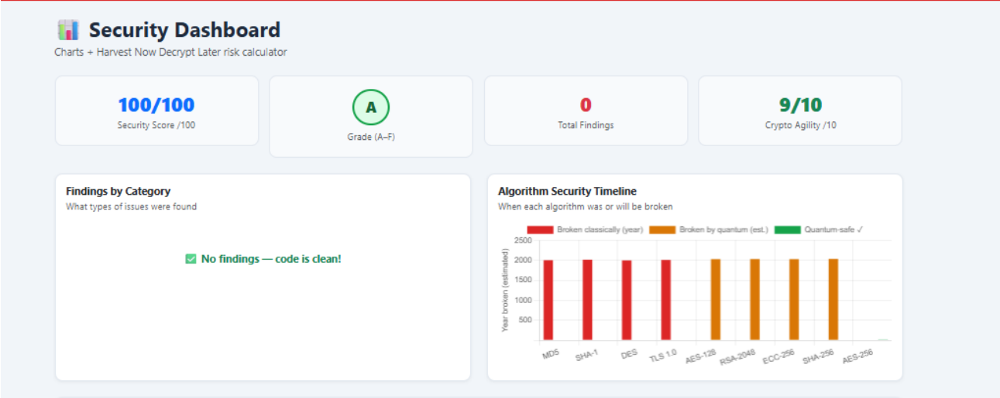
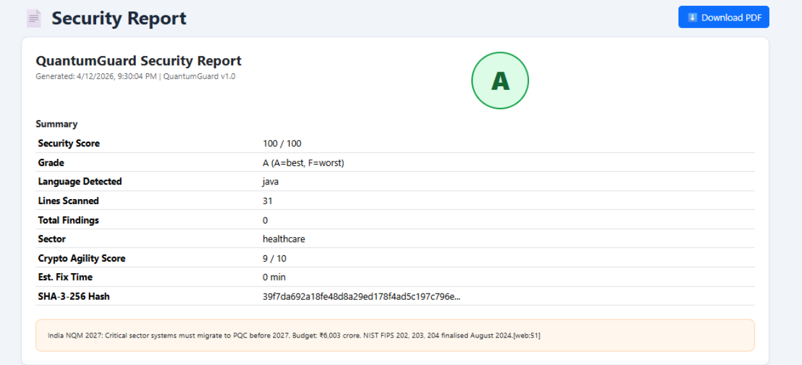
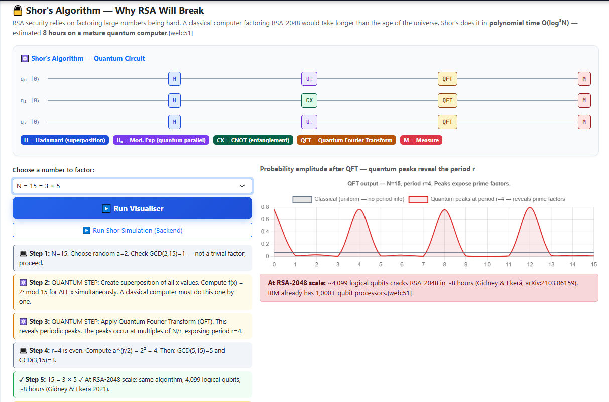

# 🛡️ QuantumGuard

A web-based **Post-Quantum Code Security Scanner** that detects common software security vulnerabilities while educating developers about the impact of quantum computing on modern cryptography.

QuantumGuard combines **static security analysis**, **interactive dashboards**, **security reporting**, and **quantum cryptography visualizations** into a single educational platform.

---

## ✨ Features

### 🔍 Security Scanner
- Scan source code for common security vulnerabilities
- Supports Java, Python, JavaScript, PHP, Go, C, C++, C#, Ruby, Kotlin, Swift and Rust
- Detects present-day security issues and future quantum-related threats
- Generates SHA3-256 hashes for scanned code

### 📊 Security Dashboard
- Security Score (0–100)
- Crypto Agility Score
- Overall Security Grade
- Findings Summary
- Algorithm Security Timeline

### 📄 Security Report
- Professional security report
- Security metrics
- Vulnerability summary
- SHA3-256 verification hash

### ⚛️ Quantum Computing Module
- Shor's Algorithm visualization
- Grover's Algorithm visualization
- Quantum Random Number Generator (QRNG)
- Interactive quantum circuit demonstrations
- Educational explanation of post-quantum cryptography

### 🌙 User Experience
- Responsive web interface
- Dark mode support
- Interactive navigation
- Sample vulnerable programs for testing

---

# 🛠️ Tech Stack

### Frontend
- HTML5
- CSS3
- JavaScript

### Backend
- Java

### Concepts Used
- Static Code Analysis
- Cybersecurity
- Post-Quantum Cryptography
- SHA3-256
- CRYSTALS-Kyber (Educational)
- Quantum Computing

---

# 📸 Project Screenshots

## 🏠 Home

Main landing page introducing QuantumGuard and its core features.



---

## 🔍 Scanner

Paste source code or upload a file to perform security analysis.



---

## 📊 Scan Results

Detailed scan results including security score, crypto agility, findings and SHA3-256 hash.



---

## 📈 Security Dashboard

Interactive dashboard showing security metrics and algorithm security timeline.



---

## 📄 Security Report

Professional report summarizing the scan with overall security assessment.



---

## ⚛️ Quantum Computing

Interactive visualization of Shor's Algorithm demonstrating quantum circuits and the future impact on RSA encryption.



---

# 🚀 How to Run

## Clone the repository

```bash
git clone https://github.com/parthkel-max/QuantumGuard.git
```

## Open the project

Open the project folder in **Visual Studio Code** or your preferred IDE.

## Frontend

Open:

```
index.html
```

in your browser.

## Backend

Compile and run the Java backend if required for server-side features.

```
QuantumGuardServer.java
ScannerService.java
```

---

# 📁 Project Structure

```
QuantumGuard
│
├── index.html
├── dashboard.html
├── results.html
├── report.html
├── help.html
├── quantum.html
├── scanner.js
├── style.css
├── QuantumGuardServer.java
├── ScannerService.java
├── screenshots/
│   ├── home.png
│   ├── scanner.png
│   ├── results.png
│   ├── dashboard.png
│   ├── report.png
│   └── quantum.png
└── README.md
```

---

# 🎯 Purpose

QuantumGuard was developed as an educational cybersecurity project to demonstrate how traditional software security and modern post-quantum cryptography can be combined into an interactive developer tool.

The project helps users understand:
- Present-day software vulnerabilities
- Future quantum threats to cryptography
- Secure hashing techniques
- Quantum algorithms through visual simulations

---

# 🔮 Future Improvements

- User authentication
- Database integration
- Cloud deployment
- AI-assisted vulnerability explanations
- More programming language support
- Real-time collaborative scanning
- Integration with GitHub repositories

---

# 👨‍💻 Author

**Parth Sachin Kelkar**

Computer Engineering Student

GitHub: https://github.com/parthkel-max

---

## ⭐ If you found this project interesting, consider giving it a star!
